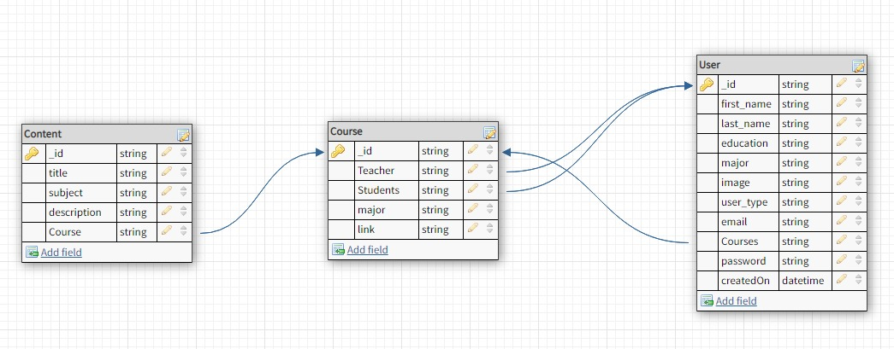
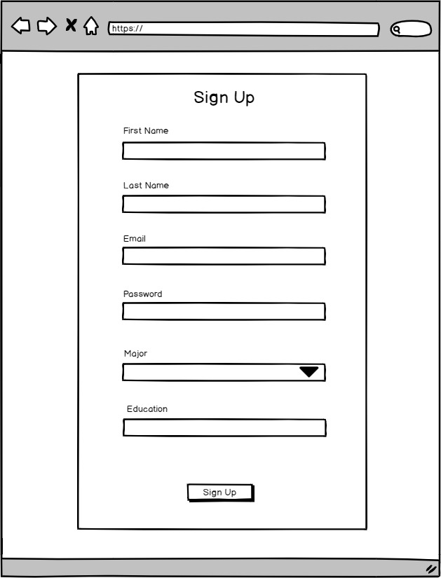
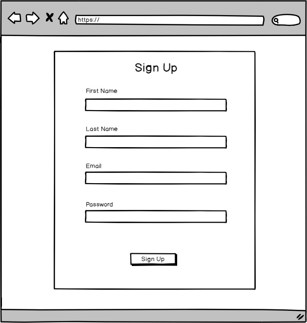
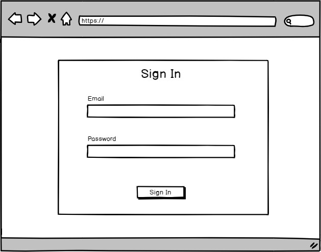
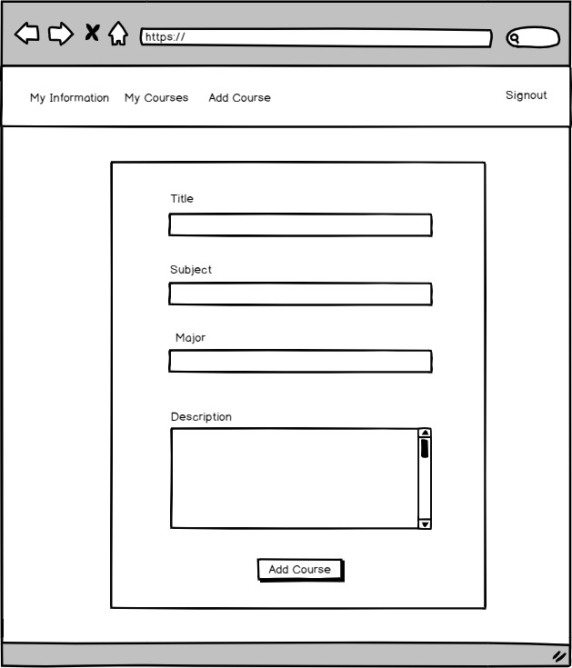
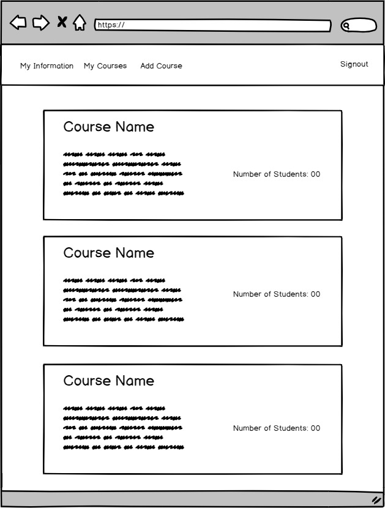

# uranus_web_application
[link to the Web App](https://online-courses-project.herokuapp.com)
This project was bootstrapped with [Create React App](https://github.com/facebook/create-react-app).

# Online Course 
Website for online courses.


## Technologies used:
- We used in Frontend React and React bootstrap , In backend Node js and MongoDB.

## Data Base:

## Wireframes:

